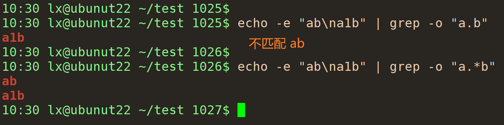

正则表达式学习笔记  
  
# 学习资源  
> 新手初学：[regex101](https://regexlearn.com/zh-cn)  
> [learn regex](https://github.com/ziishaned/learn-regex)  
> 在线测试正则表达式：[regexr](https://regexr.com/)  
> 在线测试正则表达式：[regex101](https://regex101.com/)  
> [The Stack Overflow Regular Expressions FAQ](https://stackoverflow.com/questions/22937618/reference-what-does-this-regex-mean)  
> [regular-expressions.info](https://www.regular-expressions.info/)  
> [regexone](https://regexone.com/)  
> [regexlearn](https://regexlearn.com/zh-cn)  
> 一些常见正则表达式写法，如手机号等：[i hate regex](https://ihateregex.io/)  
> [regulex](https://jex.im/regulex/#!flags=&re=%5E(a%7Cb)*%3F%24)  
> [闯关学正则表达式](https://www.codejiaonang.com/#/courses)  
> [Regexp](https://ruby-doc.org/core-1.9.3/Regexp.html)  
> 正则表达式必知必会官网：[Learning Regular Expressions](https://forta.com/books/0134757068/)  
  
  
## 常用正则表达式示例  
> [iHateRegex](https://ihateregex.io/)  
  
  
## 测试正则表达式  
> [regexr](https://regexr.com/)  
> [regex101](https://regex101.com/)  
> [regextester](https://www.regextester.com/)  
  
## 学习过程  
1. 新手初学  
- 内容很少，很快练习完一遍，对正则表达式有个概念：[regex101](https://regexlearn.com/zh-cn)  
- 在该网站学习一遍，很基础课程，看入门和进阶两个课程，可以很快练习一遍：[编程胶囊](https://www.codejiaonang.com/#/courses)  
- github 一个文档再看一遍巩固，内容很少，可以很快看完：[learn regex](https://github.com/ziishaned/learn-regex)  
- 看一遍 [正则表达式必知必会](https://pan.baidu.com/s/1bniDd7eL-3Os7k96we68eQ?pwd=qiay)，很小一本书  
- 查询语法和测试：[regexr](https://regexr.com/)  
  
  
# 正则表达式、通配符 和 模式扩展  
- 通配符仅用于处理文件名，不能搜索字符串  
```bash  
[root@ubuntu22-c0 shell_scripts]$ ls *.sh  
```  
  
- 正则表达式可以匹配和处理文本中的内容以及文件名  
在很多工具，如 vim, grep, sed 等中使用，不同的程序中的实现可能不同  
  
- 模式扩展是一种Shell的功能，用于展开匹配特定模式的字符串  
它是Shell的一部分，不需要任何额外的工具或命令  
模式扩展使用一些特殊字符和语法来匹配和展开模式  
```bash  
[root@ubuntu22-c0 ~]$ echo {0..3}  
0 1 2 3  
```  
  
# 正则表达式介绍  
- 正则表达式是用来匹配和处理文本的字符串  
- 正则表达式在不同的应用程序/语言中的实现可能不同  
  
# 正则表达式分类  
> sed: [5.2 Basic (BRE) and extended (ERE) regular expression](https://www.gnu.org/software/sed/manual/html_node/BRE-vs-ERE.html)  
> grep: [3.6 Basic vs Extended Regular Expressions](https://www.gnu.org/software/grep/manual/html_node/Basic-vs-Extended.html)  
  
  
- 基本正则表达式 BRE  
default in `sed` and `grep`  
- 扩展正则表达式 ERE  
`sed -E` and `grep -E`  
  
  
# 正则表达式引擎  
> [REGEX ENGINES](https://devopedia.org/regex-engines)  
  
正则表达式引擎是利用使用的正则表达式处理文本的软件库或工具，如 PCRE  
  
  
# 规则  
- 默认区分大小写，如果要忽略大小写，需要加上标志 `/i`  
  
# 基本元字符  
> [Metacharacter](https://www.computerhope.com/jargon/m/metachar.htm)  
  
- 元字符可以是单个字符或字符集，有特殊含义的字符  
  
## .  
- 匹配**除了回车和换行**外的任意其他字符  
- 不能匹配空，如 `a.` 不可以匹配 `a`（grep 中测试）  
- `[.]` 方括号内的点表示的为**点这个符号**  
- `\.` 匹配字符 `.`  
  
  
  
## []  
- 匹配方括号的字符集的字符  
- `[A-z]` 匹配 ASCII 码在 `A` 和 `z` 之间的字符，其中还包括一些 `[` 等字符，可通过 `man ASCII` 查看 ASCII 码范围  
- 如果范围是 `[z-a]` 这种从小到大的顺序，则匹配失效  
  
## [^]  
- 排除方括号中除了 `^` 以外的字符，`^` 在 `[]` 中是元字符  
- 如果要排除，`^` 必须为方括号中的第一个字符，如 `[^abc]` 匹配 `abc` 以外的字符  
- `[a^b]` 匹配字符 `a` `^` `b` 三个字符  
- `^` 在方括号外面是位置元字符，匹配字符串开头  
  
## -  
- 连字符 `-` 只有在 `[ ]` 中，且像 `[a-z]` 或 `[0-9]` 这种形式才是元字符，用来定义范围；`[-]` 匹配 `-` 字符本身  
- `-` 在其他地方是普通字符，不需要转义   
  
## |  
- `(T|t)he|car` 表示匹配 `The` 或 `the` 或 `car`  
 - 如果用 `|` 来连接多个子表达式，其评估的顺序是从左到右，当第一个满足要求时，就不再评估后面的子表达式  
  
## \  
- `\` 是元字符，用来转义，如果要匹配 `\`，则要用 `\\`  
- 当想用一些有特殊含义的字符本身时，需要加上转移字符  
- 有特殊含义的字符有：`{ } [ ] / \ + * . $ ^ | ?` 等  
**************  
- 注意：`/` 不是元字符不需要转义，但有些正则表达式解析器需要转义，因此使用时可以转义 `\/`  
  
  
# 字符集合元字符  
## \w  
- 匹配大小写字母、数字和下划线，即 `[a-zA-Z0-9_]`  
  
## \W  
- 匹配除了 `\w` 能匹配的字符之外的任意字符，即 `[^\w]`  
  
## \d  
- 匹配数字，即 `[0-9]`  
  
## \D  
- 匹配非数字，即 `[^\d]`  
  
## \s  
- 匹配空白字符，即 `[\t\n\f\r\v]`  
- `\f` 为换页符  
- `\t` 为制表符  
- `\v` 为垂直制表符  
- `\r` 为回车  
- `\n` 为换行  
- 退格键`[\b]` 不在匹配字符中，`\S` 也没将其排除 （？正则表达式必知必会）  
  
## \S  
- 匹配非空白字符，即 `[^\s]`  
  
## \x  
- `\x` 匹配十六进制数  
  
## \0  
- `\0` 后接 2 位或 3 位数字，匹配八进制数  
  
# 位置元字符  
## \b 界定单词  
- `b` 即 `boundary`，单词的定义和 `\w` 相同，即字母数字和下划线界定为一个单词组成  
- 边界即与其遇到不属于同一类的字符  
- 如果要匹配的字符属于单词，即 `\w` 类，则边界为不属于单词的字符，可以是空格，或其他字符，如 `+` 等  
- 如果要匹配的字符不属于单词，即 `\W` 类，则边界为单词，即数字，字母和下划线  
- 无单词边界限制时  
  
- 前后都加上边界  
  
- 单词边界并不是根据空格，如果有其他字符也会认为到了边界  
  
  
  
## \B  
- 与 `\b` 相反  
- 当要匹配的是单词  
  
  
  
- 当要匹配的不是单词  
  
  
  
  
  
## ^   
- `^` 不作为排除的元字符，即 `[^]` 使用时，在 `[]` 外也为元字符，匹配字符串的的起始位置  
- `^a` 表示匹配的 `a` 必须是位于开头的字符，前面有空格或其他都不匹配  
  
  
  
  
  
## $  
- `$` 匹配字符串的结尾  
- `$` 前面的字符必须是最后一个字符，后面还有**空格**都不匹配，但有**换行符**能匹配  
  
  
# POSIX 字符类  
> [What is POSIX? Why Does it Matter to Linux/UNIX Users?](https://itsfoss.com/posix/)  
  
## [:almun:]  
- `[0-9a-zA-Z]`  
  
## [:alpha:]  
- `[a-zA-Z]`  
  
## [:blank:]  
- 空白或制表符  
- `[\t ]`  
  
## [:cntrl:]  
- ASCII 控制字符，ASCII 码在 0-31，以及 127  的字符  
- 不可打印的控制字符  
  
## [:digit:]  
- `[0-9]`  
  
## [:graph:]  
- 可打印字符，不包含空白字符  
  
## [:lower:]  
- 任何小写字母  
  
## [:upper:]  
- 任何大写字母  
  
## [:print:]  
- 可打印字符，包含空格  
  
## [:punct:]  
- 标点符号  
- 既不属于 [:almun:] 也不属于 [:cntrl:]  
  
## [:space:]  
- [:blank:] 和换行符  
  
## [:xdigit:]   
- 十六进制数字  
  
# 量词元字符  
## *  
- 匹配前面的一个字符或子表达式 0 个或多个  
- 默认是贪婪匹配，即尽可能多的匹配  
  
  
## +  
- 匹配前面的一个字符或子表达式 1 个或多个  
- 默认是贪婪匹配，即尽可能多的匹配  
  
## ？  
- 表示选择，匹配前一个字符或子表达式 0 个或 1 个  
  
## {n}  
- 匹配前一个字符或子表达式 n 个  
  
## {m,n}  
- 匹配前一个字符或子表达式**至少 m 个，且不超过 n 个**，即 [m,n]  
- 起始范围可以是 0 次，即可以没有  
  
## {m,}  
- 匹配前一个字符或子表达式**至少 m 个**  
  
## *?  
- `*` 的懒惰模式  
  
## +?  
- `+` 的懒惰模式  
  
## {m,}?  
- `{m,}` 的懒惰模式  
  
# 大小写转换的元字符  
  
  
# Flags  
## 忽略大小写标志 i  
- `The/i` 会在查找时忽略大小写  
  
## 全局搜索标志 g  
- 不加任何条件默认只匹配第一个满足的位置，加上  `/g` 标志可以查找全部匹配字符  
  
## 多行搜索 m  
- 用 `$` 来匹配每行结尾时，默认只匹配最后一行，加上 `\m` 标志后，可在多行最后查找匹配  
- 用 `^` 匹配字符串起始位置时，如果字符位于第二行，第一行为换行符，后面的行开头也有符合的字符，不会匹配，用多行模式则能匹配  
  
  
  
  
  
  
# 贪婪模式和懒惰模式  
> [Greedy vs Lazy Matching](https://github.com/ziishaned/learn-regex#6-greedy-vs-lazy-matching)  
  
- 默认 `*` `+` `{m,}` 都在贪婪模式匹配，加 `?` 切换为懒惰模式  
- 上面三种元字符的懒惰模式对应为 `*?` `+?` `{m,}?`  
  
  
  
  
&nbsp;  
  
# 子表达式  
 - 子表达式为了匹配一组较长的字符，将其视为一个单一的实体来使用，如用量词元字符时可以重复多个子表达式  
 - 子表达式是用 `()` 包围的字符串，`()` 也为元字符，如果要匹配该字符本身，则要转义  
 - 如果为了可读性而将表达式的某些部分加上括号，对于匹配的结果没有影响，但可能影响性能  
 - 子表达式可以嵌套  
 - 如果用 `|` 来连接多个子表达式，其评估的顺序是从左到右，当第一个满足要求时，就不再评估后面的子表达式  
  
  
#  回溯引用（backreference）  
- 回溯引用允许引用之前匹配的结果  
- 不同的正则表达式实现中，回溯引用的语法可能不同  
- 回溯引用可以当作变量来理解  
- 回溯引用的匹配通常从 1 开始，`\1` 对于匹配的第一个子表达式，然后依次递增  
- `\0` 可以用来匹配整个正则表达式  
  
****************  
- 子表达式是按照其相对位置来引用的，如果删除或移动子表达式，即位置改变，则其引用将出错  
- 某些正则表达式的实现支持**命令捕获**，即给每个子表达式起一个唯一的名称，随后引用该名称  
  
  
  
  
  
# 环视 lookaround  
## positive lookahed 正向前查找 ?=  
- `a(?=b)` 表示匹配字符 `a`，且 `a` 后面必须跟一个字符 `b`，但字符 `b` 不出现在匹配的结果中，只是用来定位查找 `a`，即查找 `b` 前面的字符 `b`  
- 记忆：vim 中向前查找为 `？`  
  
## positive lookbehind 正向后查找 ?<=  
- `(?<=a)b` 表示在字符 `a` 后面的字符 `b`，同样用于定位的字符 `a` 不出现在匹配结果中  
  
##  negative lookahead 负向前查找 ?!  
- 和 `?=` 查找方法相同，如 `a(?!b)`，但是取后面没有字符 `b` 的字符 `a`，相当于 `?=` 相反的效果  
  
## negative lookbehind 负向向后查找 ?<!  
- 相当于 `?<` 的非，如 `(?<!a)b` 表示取不在字符 `a` 后面的字符 `b`  
